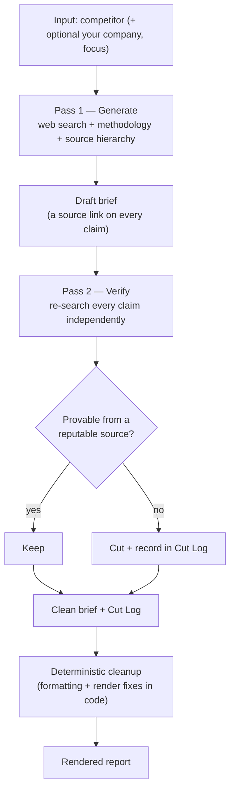

# Scout v1 — verified-brief pipeline

> Part of the [Scout repo](../README.md). This is **v1**: the fixed generate→verify
> *pipeline*. The model-driven agent ("Agent Scout") lives in [`../v2/`](../v2/). v1 is frozen
> and self-contained — it can be run or deployed on its own at any time.

**Competitive intelligence that fact-checks itself.** 
Give Scout a competitor — and optionally your own company and a focus area — and it returns a strategic brief: executive summary, battlecard, objection handling and more. Every factual claim is verified against public sources before it reaches you, and anything that can’t be verified is cut — and logged, so you can see exactly what was removed and why.


🔗 **[Live demo](https://agent-scout.streamlit.app)** · password in my LinkedIn bio · 📄 sample reports are loaded in the app’s first tab

> **Contents:** 
For the user: [What it produces](#what-it-produces) 
For the curious: [How it works](#how-it-works)
For the nerd: [Design decisions](#design-decisions-the-interesting-part): which is where the real thinking is.

-----

## The 30-second version

Most “AI competitive intelligence” produces a confident wall of text where you can’t tell which claims are real. Scout’s bet is the opposite: **a shorter ACTIONABLE brief you can trust beats a longer brief you have to fact-check yourself.**

It works in two passes. The first researches the competitor and drafts a brief with a source link on every claim. The second **re-checks every claim against the web independently**, keeps only what it can verify from a reputable source, cuts the rest, and writes a **Cut Log** explaining each removal. The verification step IS the product.

## The differentiator: it cuts what it can’t prove + makes actionable recommendations

Every brief ends with a Cut Log — the claims that didn’t survive verification. It’s the difference between an AI that sounds authoritative and one you can actually hand to a sales team.

A real catch from the **Anthropic vs. AWS** sample: the first pass drafted “Anthropic is Google’s biggest cloud client.” The verifier re-checked it, found Anthropic’s own statements naming **AWS** as its primary cloud and training partner, and corrected the attribution — logging the fix. A wrong, confident, load-bearing claim, caught before it could mislead a rep in a live deal.

And every claim it keeps comes with a “So what:” — the decision it should change. Verified, then actionable.

<details>
<summary><b>The fun stress test (and why it matters)</b></summary>

To prove the verifier isn’t domain-specific, I pointed Scout at **Superman vs. Batman** — a topic with zero filings and pure fandom noise. It still did its job: it caught a canonical sourcing error (the kryptonite arrow in *The Dark Knight Returns* was fired by Green Arrow, not “spat by Batman” as the draft claimed), demoted forum claims to sentiment, refused to present an analytical inference as a verbatim character quote, and cut a dozen inspirational-sounding but unattributable lines. The Cut Log was long *because the tool is honest.* That’s the point.

</details>

## What it produces

A brief built the way a PMM would actually want it — verdicts first, every point earning its place:

- **Executive summary** — 3–5 conclusions ordered by impact, each ending in a mandatory **So what:** line. A finding with no decision attached is noise; Scout won’t ship one.
- **Snapshot** — what they do, size/funding, hiring and leadership signals, read for *what they reveal*, not just listed.
- **Recent strategic moves** — launches, pricing, partnerships, with dates and what they signal.
- **Positioning & differentiation** — their real language and real differentiators.
- **Pricing & packaging** — tiers, model, list prices where public; says “no public pricing found” rather than guessing.
- **Battlecard** — three honest zones: where you win, where it’s a fight, where they win — with a usable soundbite per zone.
- **Sentiment** — what users actually say, clearly labeled as sentiment, never as fact.
- **Objection handling** — likely objections grounded in real weaknesses, each with an evidence-based response.
- **Cut Log** — what was removed or corrected during verification, and why.

## How it works



Two calls to the Claude API, both with the web search tool enabled. The discipline that makes the output *intelligence* rather than *information* lives in [`methodology.md`](methodology.md) — a plain-English spec the model is held to, kept out of code so it can be edited without touching the engine.

## Design decisions (the interesting part)

**1. Two passes, not one.** Generation and verification are separate calls with separate jobs. A model asked to “write a brief and only include true things” will rationalize its own claims. A second pass with one job — *re-search this and cut what you can’t confirm* — is adversarial to the first pass’s output, and that’s the point. The verifier returns only survivors plus the Cut Log. 

The trade-off is deliberate — more tokens per run for accuracy and actionability you can hand to a sales team without re-checking. Given the hours of manual verification it replaces, that’s the right trade.

**2. Source quality is typed, not flat.** The hierarchy separates four things the report must never blur: **verified fact** (filings, transcripts, contracts), **the company’s own claim** (their blog/PR — trusted for positioning, never for “we’re the market leader”), **analyst/modeled estimate** (Gartner, market-share firms — attributed and labeled as estimates, not stated like audited numbers), and **sentiment** (reviews and forums, never a factual source). A 10-K and a marketing page are both “official.” They are not the same kind of true.

**3. The control-vs-autonomy line — the decision I’d defend.** LLM formatting compliance tops out around 90–95%, not 100%. So I drew a line: **anything deterministically fixable is fixed in code; everything requiring judgment is left to the model.** Dollar-sign escaping (Streamlit renders `$…$` as LaTeX and garbles every figure), broken-bullet stitching, and stripping a stray cover-block the model occasionally emits are all handled by `format_report()` and `clean_output()` — reliably, every time. The model is asked for analysis and sourcing, not pixel-perfect markdown. Knowing *which* problems to solve with code and which to delegate to the model is the whole skill, and it’s exactly the judgment that agent design demands.

**4. Pinned model, reproducible runs.** The model ID is pinned (`claude-sonnet-4-6`), not an evergreen alias, so the repo behaves the same for anyone who clones it.

## Known limitations (read this before trusting it)

- **It’s a pipeline in v1, and a study for an agent precursor** The control flow is fixed and written by me: generate → verify → render, the same two calls in the same order every time. A real agent decides for itself which tools to call, in what order, and when it’s done. That’s [v2](#roadmap). 
- **Public sources only.** The highest-value CI — win/loss data, negotiated pricing, private roadmap — isn’t public. Scout names that gap instead of guessing past it.
- **Verification reduces error; it doesn’t eliminate it.** A confidently-wrong reputable source can still slip through. The Cut Log shows the work so you can judge.
- **Generated briefs are strong but not infallible.** The two-pass verification cuts most errors and reconciles contradictions, but a model’s judgment caps below 100% — so published samples get a human editorial pass before they ship. Knowing where to trust the model and where to keep a human in the loop is the design philosophy, not a footnote.
- **Free-tier hosting sleeps** when idle, so the first load has a ~30s cold start.

## Roadmap

|Version|What                                                                                                                                                                                                           |Status   |
|-------|---------------------------------------------------------------------------------------------------------------------------------------------------------------------------------------------------------------|---------|
|**v1** |On-demand verified briefs (this folder)                                                                                                                                                                        |✅ shipped|
|**v2** |**Agent Scout** — model-driven tool-use loop + fetch-and-read-the-source grounding + living, monitored battlecards. Now in [`../v2/`](../v2/).                                                                  |✅ shipped|
|**v3** |Proactive monitoring — use timestamped baselines to surface only what’s *new and material* since the last run, as a morning delta                                                                              |planned  |
|**v4** |Delivery into the tools teams live in (Slack, email, Notion)                                                                                                                                                   |planned  |

The v1→v2 jump is the real story: same interface, same methodology, ~75–80% reused — the rewrite is specifically the orchestration core, from a pipeline I control to a loop the model drives. The git history is meant to show that evolution.

## Tech stack

Python 3.12 · [Streamlit](https://streamlit.io) · [Anthropic Claude API](https://docs.claude.com) with the built-in web search tool · deployed on Streamlit Community Cloud.

## Run it locally

```bash
git clone https://github.com/uroshp/scout-ci.git
cd scout-ci/v1
python3 -m venv .venv && source .venv/bin/activate
pip install -r requirements.txt
cp ../.env.example .env        # then add your Anthropic API key
streamlit run app.py
```

(From the repo root, the same app launches with `streamlit run v1/app.py` — paths are
anchored to the file location, so it runs from any working directory.)

|Variable           |What it’s for                                                    |
|-------------------|-----------------------------------------------------------------|
|`ANTHROPIC_API_KEY`|Your Anthropic API key ([console](https://console.anthropic.com))|
|`APP_PASSWORD`     |Gates the app; set a real value when deploying                   |

**Deploying:** push to GitHub → [share.streamlit.io](https://share.streamlit.io) → set both variables under *Advanced settings → Secrets*. Set a **hard** spend cap in the Anthropic console before going public.

## Repo structure

```
v1/
├── app.py                 # Streamlit UI: tabs, password gate, cut-log expander, deterministic cleanup
├── research.py            # Engine: generate_brief → verify_brief → save_report
├── methodology.md         # The CI discipline the model is held to (editable, not buried in code)
├── reports/               # Committed sample briefs (the in-app dropdown reads from here)
├── test.py · sdk_test.py  # Ad-hoc API smoke scripts (not a test suite)
└── requirements.txt
```

(`.env.example` and `.streamlit/config.toml` live at the repo root and are shared.)

## Why I built this

I’m a product marketing leader with a computer-science background, and I think GTM people should be able to *build* the tools they imagine, not just spec them and wait. Scout is competitive intelligence the way I always wanted it — verdicts over volume, and honest about what it doesn’t know. It’s also a deliberate study in the question every team is now asking: where do you let a model decide, and where do you constrain it in code? v1 is my answer for a tool. v2 is my answer for an agent.

— [LinkedIn](https://www.linkedin.com/in/urospajic)

## License

MIT — see [LICENSE](LICENSE).