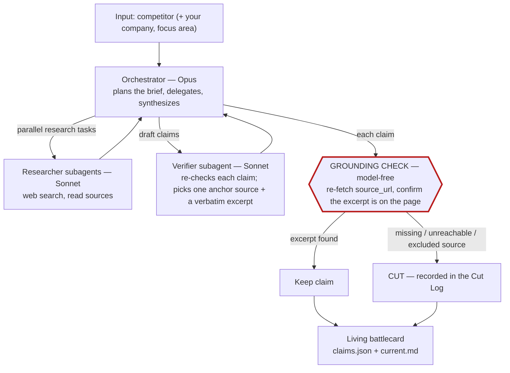
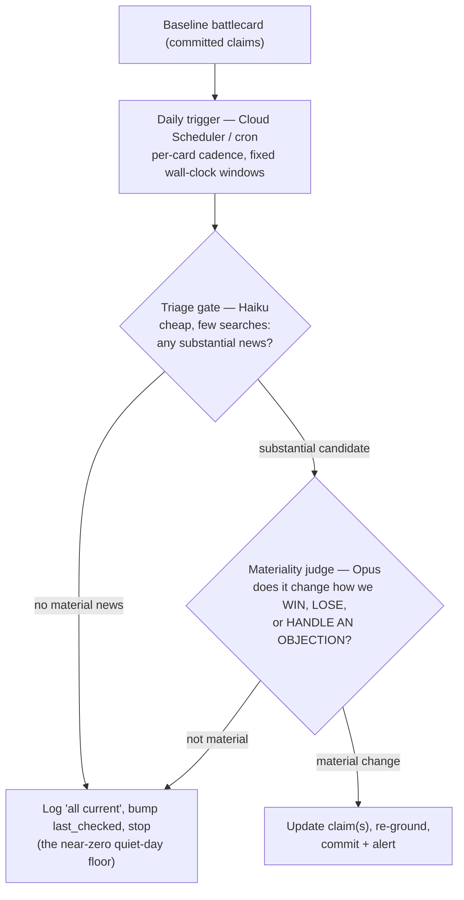
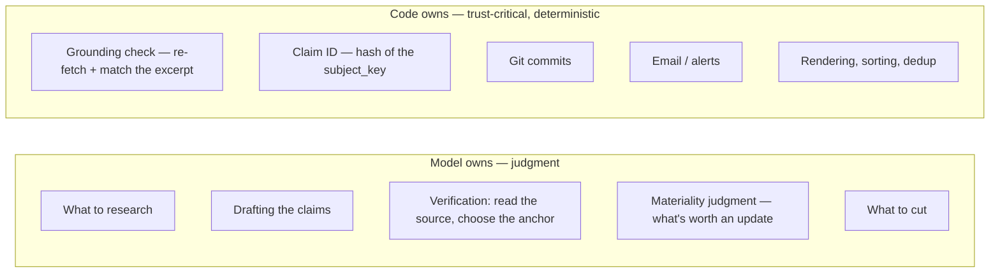

# Scout v2 — Architecture

Three views of how Agent Scout works. The throughline is the **control-vs-autonomy boundary**:
the model owns judgment; deterministic code owns anything trust-critical. The clearest expression
of that line is the **grounding check** — a model-free step that re-fetches each cited source and
confirms the quoted evidence is actually on the page. No claim survives without passing it.

> Diagrams are [Mermaid](https://mermaid.js.org/); GitHub renders them inline.

## 1. Generation flow

An Opus orchestrator plans the brief and delegates legwork to Sonnet subagents. Every drafted
claim then hits the grounding gate (highlighted) — the **model-free trust boundary**. Claims whose
verbatim excerpt is found on the live page are kept; everything else is cut and logged.

## 2. Monitoring loop

Each card is re-checked on a fixed daily schedule. A cheap Haiku **triage gate** runs every time;
the expensive Opus **materiality** judgment runs only when triage flags genuinely substantial
news — so a quiet day costs pennies, and only *material* changes ever touch a claim.

## 3. Control vs. autonomy

The design rule for every step: **deterministically fixable → code; requires judgment → model.**
Provenance, identity, and side effects are never left to the model.

See [`v2-agent-spec.md`](v2-agent-spec.md) for the full design and [`claim-object.md`](claim-object.md)
for the claim schema + grounding contract.
