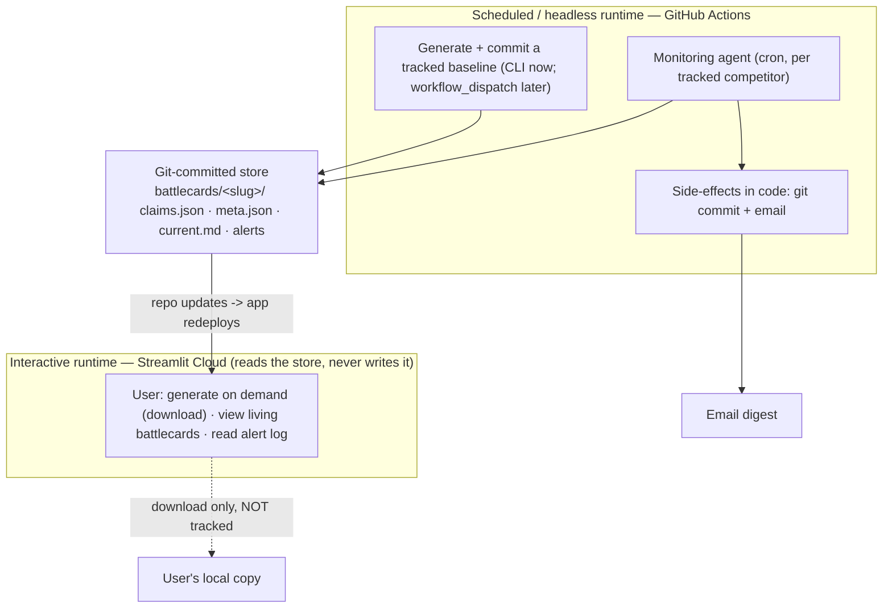

# Scout v2 — Agent Spec (the Living Battlecard)

**Status:** Final for v2, used to direct Claude Code
**Date:** June 2026.

**One line:** Scout is a self-verifying living competitive intelligence brief tool. It generates a sourced competitive brief, monitors for material changes and updates only when something changes the GTM story.

-----

## 1. Introducing the agentic structure

v1 is a fixed pipeline: generate → verify → render, the same two calls in the same order every time. It produces a document. A document is a snapshot: true the day it’s made, stale the week after.

v2 is an agent because it has a *recurring job that requires judgment on every cycle*: watch a set of competitors, decide what has genuinely changed, decide whether each change is **material** (does it move a battlecard zone, a price, a positioning claim or introduce a risk?), and surface only the signal along with a “so what” all while staying silent when nothing matters.

> Re-running a report on a schedule is a cron job; judging materiality and maintaining a living document is an agent.

The agentic loop, stated plainly: **monitor → detect change → assess materiality → decide signal vs. noise → update the battlecard + alert with a so-what.** The cuts and the silence are as much the product as the alerts.

-----

## 2. Architecture: two runtimes, one git-committed store



**Write path is unambiguous: only the scheduled/headless runtime writes the store.**

- **Interactive runtime (Streamlit Cloud)** — generates a brief on demand and offers it for **download**, and **reads** the store to display living battlecards and the alert log. It does **not** commit. (Streamlit Cloud can’t reliably write back to git.) **Public demo generation is not tracked unless its folder is committed.** **Runtime split (decided):** the Agent SDK drives the Claude Code CLI under the hood (Node + subprocess), which Streamlit Community Cloud may not host. So in-app generation stays on the **v1 Messages-API path** (server-side web search, the proven `_extract` citation handling); the **Agent SDK is used only by the headless worker.** Step 1 of the build (§15) verifies the SDK on the headless runtime before any port. Same generation *logic and quality bar* on both; different transport.
- **Scheduled / headless runtime (GitHub Actions)** — owns persistent tracking. A baseline becomes “tracked” when its folder is committed (via CLI now; a `workflow_dispatch` trigger from the app is a later option). The cron monitor then maintains it, commits updates, and sends email.
- **Shared store** — files committed in the repo. The git history *is* the living battlecard’s heartbeat — a visible record of the document evolving (good for the portfolio story; see commit policy in §9).

**Why this split (interview answer):** monitoring must run with no user present, which Streamlit Cloud cannot do. Separating the interactive face (reads) from the headless worker (writes), with git as shared state, is zero-new-infra and keeps the write path single and clear.

-----

## 3. Models — verified, but kept as config

Defaults verified against Anthropic docs (June 2026), but **never hardcoded** — set in `.env`/config so the spec survives renames:

```
ORCHESTRATOR_MODEL=claude-opus-4-8     # judgment: planning, materiality, synthesis, consistency
SUBAGENT_MODEL=claude-sonnet-4-6       # legwork: research + verification, run in parallel
FAST_MODEL=claude-sonnet-4-6           # cheap triage gate (could be a haiku-class model)
```

|Role                                          |Default                  |Why                                                       |
|----------------------------------------------|-------------------------|----------------------------------------------------------|
|Orchestrator                                  |Opus 4.8 ($5/$25, 1M ctx)|The reasoning that decides what’s signal.                 |
|Subagents (researcher, verifier, change-scout)|Sonnet 4.6 ($3/$15)      |Fast/cheap enough to parallelize the legwork.             |
|Triage gate                                   |Sonnet / Haiku           |The cheap “is there anything here at all?” check (see §6).|

Confirm the exact SDK API for per-agent model assignment during build; read IDs from config.

-----

## 4. SDK and the agentic loop

Built on the **Claude Agent SDK** (`pip install claude-agent-sdk`, Python 3.10+) — the same harness that powers Claude Code, so this *is* the “built with Claude Code” story. The SDK runs the loop autonomously (vs. v1’s hand-written tool loop). We define agents, tools, and guards; the orchestrator decides what to call, in what order, and when it’s done.

Primitives: `query()` with an orchestrator prompt + `agents={...}` (`AgentDefinition`: description, prompt, tools, model). Built-in tools — **`WebSearch`** (reused capability), **`WebFetch`** (the new capability: read sources, not just search), **`Agent`** (invoke subagents). **Hooks** (`PreToolUse`, `Stop`) for guards.

> **Control-vs-autonomy line (the core principle, carried from v1):** the agent owns *judgment* — what to research, how deep, what’s material, what to write. Deterministic **side-effects stay in code**: git commits and email are NOT agent tools; the agent emits a structured result and plain code performs the commit and sends the mail. Output cleanup (`clean_output`/`format_report`) stays a deterministic post-step. A confused agent therefore cannot spam alerts, double-send, or corrupt the repo.

-----

## 5. The generation agent (brief -> tracked battlecard)

Input: competitor (required), your company (optional), focus (optional).

**Orchestrator (Opus 4.8)** plans the brief, delegates, synthesizes, runs the consistency sweep, emits the brief + cut log. Subagents (Sonnet 4.6):

- **researcher** — tools `WebSearch`, `WebFetch`. Gathers material per section; parallelizable.
- **verifier** — tools `WebSearch`, `WebFetch`. Re-checks each claim by *reading* the source (v1 verify discipline, now able to fetch and read). Applies the source hierarchy, judges *support*, cuts the unverifiable, emits structured claim objects (see `claim-object.md`) and cut-log entries. **Support is the model's call; provenance is code's** — after the verifier emits each claim, a deterministic **grounding check** (re-fetch `source_url`, confirm `evidence_excerpt` is a real substring of the page; fail → cut, recorded with reason) runs as a post-step. The two layers are never merged — see `claim-object.md` §4.

Reused wholesale from v1: `methodology.md`, source hierarchy, cut-log spec, formatting rules, “so what” requirement, consistency sweep, deterministic output cleanup.

Runs in the Streamlit app (on demand, download, **not tracked**) and via CLI/Action (to create a **tracked** baseline that gets committed). Same generation logic, different runtime.

-----

## 6. The monitoring agent — staged, so Opus doesn’t wake for nothing

Runs on the GitHub Actions schedule, once per tracked competitor. **Staged to control cost:** cheap retrieval and a cheap triage gate run first; the expensive judgment runs only on candidates.

1. **Load baseline** — `claims.json` + `meta.json` (baseline date, `last_checked`, alerted fingerprints).
1. **Retrieve (cheap)** — date-scoped `WebSearch` since `last_checked`, `WebFetch` to read.
1. **Triage gate (FAST_MODEL)** — “Is there anything here that *could* be material?” If no -> stop, log a no-change run (no Opus, no commit; see §9).
1. **Judge materiality (ORCHESTRATOR / Opus 4.8)** — only on candidates that pass triage. Apply the materiality threshold (§8) and verify with the same source-tiering discipline as generation. **The materiality judgment itself always runs on Opus — triage is allowed to be cheap, the decision to alert is not.**
1. **Propagate (act-grade only):** when a surviving change clears the deal-impact bar (`severity: "act"`, §8), re-derive the dependent plays and objections it changes via the propagation step (§17). A `watch`-grade change updates the feed only and stops here.
1. **Update + record** — for each material change: update the affected claims in `claims.json` (and re-render `current.md`), append to `alerts.md` + `alerts.jsonl` with a dedup fingerprint, add the fingerprint to `meta.json`.
1. **Side-effects in code** — commit changed files; send ONE email digest of material deltas (each with its “so what”). Nothing material -> no email.

**Dedup:** `meta.json` holds fingerprints (hash of headline/URL/claim) of everything already alerted, so the same event isn’t re-alerted nightly.

-----

## 7. State / file layout (Markdown is presentation; JSON is state)

The monitor must not diff prose. Claims, sources, and fingerprints live in structured files; Markdown is rendered from them for display.

```
battlecards/<slug>/
  current.md       # rendered battlecard for display + an "as of <date>" heartbeat line
  claims.json      # the structured claim objects (state of record) — sources live inside each claim
  meta.json        # my_company, competitor, focus, baseline date, last_checked, alerted fingerprints
  alerts.md        # human-readable append-only alert log (date + so-what)
  alerts.jsonl     # machine-readable alert records, one JSON object per line
reports/           # v1 timestamped samples (showcase) — unchanged
```

Sources are folded **into** each claim, and the battlecard is **derived** from claims — so there’s no separate `sources.json`/`battlecard.json` to keep in sync. Three state files (`claims`, `meta`, `alerts.jsonl`) do what five would.

**Claim object (the verification contract — makes “verified” concrete and auditable):** the full schema, ID scheme, and grounding contract live in **[`claim-object.md`](claim-object.md)** (the first concrete v2 artifact). Shape, abbreviated:

```json
{
  "id": "c_a1b2c3d4e5f6",
  "subject_key": "aws | fy-revenue | 2025",
  "claim": "AWS full-year 2025 revenue was $128.7B.",
  "claim_type": "fact | interpretation | sentiment",
  "section": "executive_summary | snapshot | recent_moves | positioning | pricing | battlecard | sentiment | objection_handling",
  "zone": "where_we_win | contested | where_they_win | null",
  "order": 2,
  "source_url": "https://...",
  "source_tier": "primary | reputable_secondary | sentiment_only",
  "evidence_excerpt": "verbatim span copied from the fetched source",
  "as_of": "2026-02-06",
  "verified": true,
  "confidence": "high | medium | low",
  "grounding": { "checked": true, "match": true, "method": "substring", "fetched_at": "2026-06-03", "detail": null }
}
```

Rule, phrased precisely (not as an absolute): **every factual claim must be backed by fetched source evidence or it is cut.** `source_tier` maps to the v1 hierarchy — `primary` = Tier 1A (filings/transcripts/contracts), `reputable_secondary` = Tier 2/2E (news / analyst-estimate, labeled), `sentiment_only` = Tier 3S/4. A `fact` claim may not rest on `sentiment_only`. This makes the verifier’s job mechanical enough to audit. Three decisions baked into the schema:

- **Identity is the subject, not the text.** `id` is a deterministic hash of `subject_key` (`entity | attribute | qualifier`, value-independent). When a figure changes or a CEO is replaced, the new claim hashes to the **same `id`**, so the monitor updates in place instead of duplicating. The value lives only in `claim`.
- **Identity excludes presentation.** `section` / `zone` / `order` are mutable display attributes — moving a claim between sections must not change its `id`. They also let `current.md` be rendered by deterministic code (each claim knows its section, zone, and sort order) rather than an LLM pass.
- **Grounding is provenance, not support.** A deterministic check confirms the `evidence_excerpt` is really on the fetched page; whether it *supports* the claim is the verifier's separate, semantic job.

**Slug must encode perspective**, because a battlecard is not “Google Cloud” — it’s “AWS vs Google Cloud in cloud infrastructure”:

```
<my-company>__vs__<competitor>__<focus>     e.g. aws__vs__google-cloud__cloud-infra
```

If `my_company` is absent, use `scout__vs__<competitor>__<focus>`. A short hash may be appended for uniqueness. Full fields are also stored in `meta.json`.

-----

## 8. Materiality threshold (the agentic heart — where the effort goes)

This is the judgment that separates an agent from a cron job. Most of it already lives in `methodology.md` (signal vs. noise); v2 adds an explicit threshold for *change*.

**Material (alert + update):** funding, M&A, exec hires/departures, pricing/packaging changes, major launches, security incidents/breaches, legal actions, partnership shifts, public strategy statements that change a battlecard zone or an objection. (The Mercor breach in the v1 sample is the canonical example — a battlecard-altering event.)

**Noise (ignore):** routine blog posts, minor features, conference talks with no strategic shift, restatements of known facts, sentiment churn.

Every alert must carry a **so what** — the decision it should change — or it doesn’t ship. (Designing for signal, not notification volume: most alerting tools over-notify; this one is built to stay quiet.)

**Two grades of material.** `watch` is material context that changes no rep behavior yet, so it updates the `recent_moves` feed only. `act` is strong enough to change what a rep says or does in a live deal, so it ALSO triggers propagation into plays and objections (§17). The deal-impact bar is what gates a prose change. The feed stays more permissive than the battlecard.

-----

## 9. Commit policy (preserve the living heartbeat without repo clutter)

- **Material change ->** commit the changed `claims.json` / `current.md` / `alerts.*` / `meta.json`. These are the signal commits.
- **No-change run ->** do **not** commit state; record the run in GitHub Action logs/artifacts. Keeps the log free of “checked, nothing” noise.
- **Weekly heartbeat ->** a deliberate, visible commit that updates the `as of <date> — no material change` line in `current.md`, so the document itself shows it’s alive and current even in quiet weeks. The heartbeat is part of the demo — don’t optimize it away to keep the log tidy; just keep it weekly, not daily.

-----

## 10. Guards & safety (an agent that can loop can burn money)

- **Max tool calls / iterations per run** — `PreToolUse` hook that counts and halts, and/or the SDK max-turns option (confirm name in docs).
- **Cost ceiling per run** — track token usage; abort if exceeded.
- **Staged models (§6)** — the cheapest guard of all: don’t run Opus on empty days.
- **GitHub Actions timeout** — hard wall-clock cap.
- **Anthropic account hard spend cap** — already set; ultimate backstop.
- **Side-effects gated in code** — agent can’t commit or email directly.
- **Auth** — Agent SDK runs on an API key (not claude.ai login), billed as API usage. From June 15, 2026, Agent SDK usage on subscription plans draws from a separate monthly Agent SDK credit — confirm the billing path before scheduling frequent runs.

-----

## 11. Reused vs. new

**Reused (~75–80%):** `methodology.md` (extended with the materiality threshold), source hierarchy, cut-log spec, formatting rules, “so what” discipline, consistency sweep, deterministic output cleanup, the Streamlit interface (extended to show living battlecards + alert log).

**New:** the Agent SDK orchestrator + subagent definitions (headless worker only — in-app generation stays on the v1 Messages-API path); structured claim objects (`claim-object.md`); `WebFetch` source reading + the deterministic **grounding check**; the monitoring agent + staged models + materiality layer; the GitHub Actions cron worker; the git-committed structured store + dedup; the email digest; guards/hooks. The rewrite is specifically the **orchestration core** — pipeline I control -> loop the model drives. Git history shows the evolution.

-----

## 12. Interviewer readout (what this is built to demonstrate)

- **PMM workflow understanding:** battlecards, objection handling, sales enablement, signal-over-volume.
- **Agentic design:** recurring monitoring, judgment, materiality, deliberate silence.
- **Technical judgment:** split runtimes, git-backed structured state, perspective-aware identity, staged model usage, guarded side-effects.
- **AI safety / practicality:** fetched-evidence verification, structured claim contract, cut logs, source hierarchy, cost controls.

-----

## 13. What “good” looks like

Generation (from v1): verdicts first, a “so what” on every exec point, every claim a structured object backed by fetched evidence or cut, a cut log, no internal contradictions.

Monitoring (new): only *material* deltas surface; every alert carries a “so what”; nothing re-alerts; the agent stays silent when nothing’s material; the baseline stays internally consistent across updates; the document visibly breathes (weekly heartbeat).

Demo bar: a deliberately stale baseline -> scheduled run -> agent finds real-world changes, judges them material on Opus, updates the affected claims/zones, and emails a digest with so-whats. Live, honest, no faking.

-----

## 14. Out of scope for v2

In-app tracking configuration (tracking = committed files); more than one alert channel (email only); hosted database (git files are the store); auth / multi-user; real-time event-push (scheduled polling is enough); anything that turns the materiality judgment into a side quest — that judgment IS the build; the plumbing stays minimal.

-----

## 15. Build order (for the Claude Code session)

1. Scaffold the Agent SDK **on the headless runtime**: one orchestrator + one subagent; confirm the loop runs and `WebSearch`/`WebFetch` work *there* (not just locally). Read model IDs from config. Decide here whether the SDK can also run on Streamlit Cloud; default assumption is no, so in-app generation stays on the v1 Messages-API path (§2).
1. Port generation: orchestrator + researcher + verifier producing the v1 quality bar, emitting **structured claim objects** (per `claim-object.md`) + cut log.
1. Wire the structured store (`battlecards/<slug>/...` with perspective slug) + the deterministic **grounding-check** post-step (`claim-object.md` §4) + output cleanup.
1. Monitoring loop against a stale baseline: retrieve -> **triage gate (cheap)** -> **materiality (Opus)** -> update claims + alerts + dedup.
1. Side-effects in code: git commit (per the §9 policy) + email digest.
1. Guards: hooks for tool-call cap + cost ceiling.
1. GitHub Actions cron workflow; secrets (API key, email creds). **FIRST action of this step (TRACKED RISK, do before trusting any monitoring run): re-run the reachability probe (`scout/_probe_reach.py`) from *inside* an actual GitHub Action to measure REAL production grounding reachability.** Build-step-5 probing showed ~67% reachability from Codespaces, but several sources block by **datacenter IP** (confirmed: SEC.gov 403s regardless of User-Agent, while the same content on a company IR host fetched fine). GitHub Actions is also a cloud IP, so production reachability may be materially worse — and monitoring is worthless if the worker can't ground. Measure it first; if it's bad, the fix is broader substitution / a fetch path with residential or proxied egress, decided from that data.
1. Extend Streamlit to show living battlecards + alert log (read-only).
1. Demo dry-run: stale baseline -> scheduled run -> real deltas + email.

-----

## 16. Decisions to resolve during build

- ~~Exact SDK API for per-agent model assignment and max-turns.~~ **Resolved (build step 1, `claude-agent-sdk` 0.2.88):** per-agent model via `AgentDefinition(model=...)`; orchestrator model via `ClaudeAgentOptions(model=...)`. Iteration cap via `ClaudeAgentOptions(max_turns=...)` (and per-agent `AgentDefinition(maxTurns=...)`). Cost ceiling is **native** — `ClaudeAgentOptions(max_budget_usd=...)` — so §10's per-run cost guard needs no hand-rolled token counter. Subagents registered via `agents={name: AgentDefinition}`; the orchestrator invokes them with the **`Agent`** tool (not `Task` in this version). Headless runs use `permission_mode="bypassPermissions"`. Verified live: orchestrator (Opus) delegated to a Sonnet researcher that ran `WebSearch` + `WebFetch` and returned a sourced answer.
- Email mechanism (transactional API vs. SMTP) — pick one pipe.
- Monitor cadence (start daily; tune).
- Triage-gate model (Sonnet vs. Haiku) — measure cost/accuracy before locking.

-----

## 17. Propagation: a material fact reshapes the rep-facing prose (the part that makes it *living*)

**The gap this closes.** Today the monitor is a claim *patcher*: one news item becomes one fact claim in one section, updated in place. In production every alert that has fired (five of five, across the cards that have fired) landed in `recent_moves`. `objection_handling`, the battlecard plays, `positioning`, and the exec summary have never been touched by a monitor run. So "living battlecard" has meant "a new line in the feed", not a card that rewrites itself. The plays and objections, the part a rep actually reads before a call, stay frozen. Propagation is the step that changes that, and it is the headline behavior the product is named for.

**Fan-out, not full regeneration.** Re-synthesizing the whole card on every alert would churn every claim, force re-grounding the entire card, and destroy the per-claim git and grounding diff that *is* the verification story (the receipt that makes "verified" credible: this objection changed because of this news, on this date, from this source). Propagation instead touches only the **dependent** claims a single grounded fact implies. Each stays individually grounded. Each is a clean one-claim diff.

**The gate is deal impact, not notability.** A fact propagates into plays or objections **only if it is strong enough to change a customer or deal outcome**, which is exactly the existing `severity: "act"` definition (*reps change what they SAY or DO in a live deal NOW*). This reuses a threshold instead of inventing one:

- `watch`-grade material updates the `recent_moves` feed only. The prose does not move.
- `act`-grade material updates the feed **and** triggers propagation.

Load-bearing guardrail: **"changes nothing for us" is a first-class, common verdict.** Most `act`-adjacent news still moves no specific play or objection. A proposer forced to emit a prose edit per fact would manufacture an objection for every item, the GenAI tic Scout bans elsewhere via `WRITING_STYLE`. Propagation is built to stay quiet, the way triage is.

**Detection punches both ways (dual-scope triage).** Triage searches `my_company` as well as `competitor`, and routes each candidate by valence:

- **Back foot** (competitor ships something strong, or we stumble: a model pulled, an outage, a price hike) routes to an **`objection_handling`** entry ("they will raise X, here is the answer").
- **Front foot** (competitor stumbles, or we ship) routes to a **play** (`battlecard` / `where_we_win`).

The same event can do both. Our own bad news is the case a competitor-only monitor is structurally blind to today.

**The mechanic, carried by one new field: `derived_from`.** A propagated play or objection is an interpretation derived from a grounded fact, and it has no web source of its own. Add `derived_from: <parent fact's claim id>` to the claim schema (`claim-object.md`). It does double duty:

1. **Grounding anchor.** The interpretation is verified by pointing at the grounded fact it descends from, inheriting that fact's provenance instead of needing its own URL. Without this, the verifier cuts every propagated play.
2. **Retire-cascade edge.** When a fact is later falsified (its value flips, the source is pulled), the monitor walks `derived_from` to find the dependent plays and objections it made false and acts per the operations below.

**Nothing is hard-deleted; lineage is preserved.** Identity is the subject (§7), so a changed claim keeps its `id`, and git history plus `alerts.jsonl` already record every transition. That trail IS the "tracked and updated since <date>" lineage, and it is an asset (it shows judgment and auditability, and is future training signal), so propagation never destroys it. "Remove from the active card" is a `status: retired` transition into the lineage view, never a delete.

**Operations (the judge picks one per affected claim):**

- **add** — the fact creates a new play or objection.
- **revise (in place)** — the fact *narrows but does not kill* a still-winning play, or updates an objection's rebuttal. Same `id`, new `as_of` + source; it stays on the active card. (This is the answer to "is there ever a reason to keep an undercut play": yes, when it still net-wins.)
- **retire** — the fact *neutralizes a play to a wash* OR *invalidates it (makes it false)*. Either way it leaves the active card: set `status: retired` + `retired_on` + `retired_reason` + the killing fact's `id`, and it lives only in the **lineage / retired view**. A contested-but-true play is noise to a rep mid-call ("if it's contested, don't serve it to me"), so the active card carries only live wins and live objections; everything degraded goes to lineage. If a neutralized play raises a new buyer objection, that objection is a separate **add** (the dead play goes to lineage, the live objection it spawned goes on the card).

**Blast-radius cap:** a fact may only add / revise / retire a claim it directly creates, undercuts, or invalidates. It may not touch anything else.

**Control: propose, then judge, both model, logged.** This extends the v1 generate-then-verify pattern one layer up:

1. **Propose (one pass).** From each surviving `act`-grade grounded fact, draft candidate `add` / `revise` / `retire` operations on `objection_handling` and plays, each carrying `derived_from`.
2. **Judge (independent adversarial pass).** Confirm or reject each candidate: is the implication warranted by the anchored fact, is the retire correct, is the objection real or invented. The judge may reject everything and return "no rep-facing change".

The human is not in this loop, except a deliberate interim training window that reuses the **v3.5 shadow-eval** capture path: run propose-then-judge live, surface to a human during the interim, capture the human verdicts as ground truth, and promote the judge to autonomous once agreement is high enough. The **decision log is two artifacts in one**: an audit trail of every model-made prose edit, and the judge's training corpus.

**Decision-log record (one per proposed operation):**

```json
{
  "trigger_claim_id": "c_…",            // the grounded fact that fired propagation
  "trigger_source_url": "https://…",
  "operation": "add | revise | retire",
  "section": "objection_handling | battlecard",
  "old_text": "… | null",
  "new_text": "… | null",               // null on retire
  "derived_from": "c_…",
  "judge_verdict": "confirm | reject",
  "judge_reason": "…",
  "committed": true
}
```

**Pipeline insertion point.** After triage, materiality, grounding, and retry (the fact has survived as true and `act`-grade), and before apply and render. Only `act`-grade survivors enter propagation. `watch`-grade and ungrounded items never reach it.

**Build order (proposed):**

1. Schema: add `derived_from` (+ `status` / `retired_on` / `retired_reason` for the retire band) to the claim object and `claim-object.md`. Render plays and objections with their anchor visible, plus a lineage / retired view fed by `alerts.jsonl` + `as_of`.
2. Dual-scope triage: a second search arm on `my_company`, with a valence tag on each candidate.
3. Propose pass and prompt (the `act`-grade gate, "no change is common", the add/revise/retire contract).
4. Judge pass and prompt (adversarial confirm or reject, veto-all allowed), plus the decision log.
5. Retire-cascade: on a falsified fact, walk `derived_from` and revise or retire dependents.
6. Shadow-eval hook on propagation decisions, plus the interim human-review surface.

**Resolved (2026-06-13):**

- **Graduated response, lineage preserved, no hard deletes.** Narrows-but-still-wins → revise in place and keep. Neutralizes-to-a-wash OR invalidates → retire to the lineage view (`status: retired`), off the active card. The active card serves only live wins and live objections; contested-but-true content is rep noise and is not served. Identity stays stable, so "tracked and updated since <date>" renders from `alerts.jsonl` + `as_of`.
- **Impact-scoped cap (not a count).** Propagation may only touch a claim the firing fact directly **creates, undercuts, or invalidates**, and nothing else. The cap is blast radius, not a number of operations.
- **PROPOSE step = separate staged agent** after grounding (propose on **Sonnet**, judge on **Opus**). Cost delta over inline is negligible (rare trigger), so the call was made on regression isolation and tunability: a separate agent keeps the tuned materiality prompt untouched, matches the project's "keep verification independent of drafting" rule (README), and lets propagation be shadow-evaluated on its own.

**Open (the coherence-review finding — pick before build):**

- **Thesis governance.** Propagation is the first user-facing content gated by a model with no model-free authority behind it: an interpretation cannot be deterministically grounded the way a fact can. To stay inside Scout's load-bearing thesis (*no ungrounded model judgment in the seat of final authority* — `vnext-roadmap.md`), bind propagation to it: (a) every propagated claim is `claim_type: interpretation` carrying a `derived_from` that code-checks to a surviving grounded fact; (b) a deterministic propagation **floor** (the code grader) enforces derived_from-exists, retire-points-at-an-actually-falsified-fact, no model-minted `fact` claims, and the blast-radius cap; (c) ship in **shadow first** and earn autonomy via the v3.5 champion-challenger window, with **add** (pure authorship) held most conservative and **retire-on-a-falsified-fact** freest (it is itself grounded). This sequences propagation as v2.5 *into* the v3/v3.5 eval work, not as a standalone bolt-on. Confirm this framing before build.

**Two judgments, two shadow trials (framing).** Scout exercises model judgment over user-facing content in exactly two seats. Each is qualified the same way (champion-challenger, human-adjudicated disagreements, promote only on data, code grader stays the floor):

- **Materiality / verification judgment:** should this claim exist on the card at all (the keep / cut / material call the existing v3.5 shadow-eval already targets).
- **Authorship judgment:** given a true material fact, what prose should change (propagation's add / revise / retire).

The two accumulate disagreements at very different rates (verification runs on every claim; authorship fires only on rare `act`-grade survivors), so promotion is gated on **adjudicated-delta count, not calendar**, and authorship will qualify much later than verification. **Check-in windows (set 2026-06-13):**

- **Weekly adjudication (Friday, ~15 min, skipped when the queue is empty).** One slot covers both streams; the shadow digest reports "N verification / M authorship deltas waiting", and a human labels who was actually right only when there is something to label. Most weeks: a few verification deltas, often zero authorship.
- **Promotion checkpoint, per judge, count-gated (not by calendar).** Evaluate a judge for promotion once it has roughly **30 adjudicated verification deltas** (weeks away) or **20 adjudicated authorship deltas** (likely months, given the rare trigger). The gate stays net-positive-on-deltas AND slop-admission near zero, into a bounded role only.
- **Authorship promotes in stages, safest operation first:** retire-on-a-falsified-fact (grounded) first, then revise, then add (pure authorship) last, each its own count-gated checkpoint.
- The first checkpoint is not a date. It is "review batch one", whenever capture has accumulated enough adjudicated deltas. The recurring Friday reminder is wired up only once authorship capture is live and producing data.

**What "good" looks like.** A deliberately stale baseline, a scheduled run that finds an `act`-grade change (ours or theirs), a proposer that drafts the objection it creates or the play it kills, a judge that confirms, and the relevant play or objection **visibly changing**, anchored to the grounded fact, as a clean one-claim diff. Meanwhile most facts that day produce "no rep-facing change". The card demonstrably rewrites itself, and only when a deal is actually on the line.